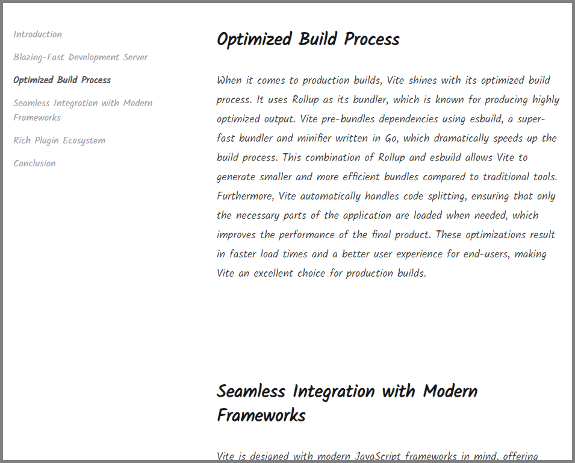

# Longform

A scaffold for a long page of text with sections.

- Table of contents
- Scrollspy-type navigation highlighting
- Responsive with drawer for small screens



## Development

Clone this repository:

```sh
git clone https://github.com/travishorn/longform
```

Change into the directory:

```sh
cd longform
```

Install the dependencies:

```sh
npm install
```

Run the development server:

```sh
npm run dev
```

## Writing

Create sections as individual markdown (.md) files in ./src/content. Make sure
to give each an `id`, `title`, and `order` in the frontmatter.

```markdown
---
id: introduction
title: Introduction
order: 0
---

## Introduction

In the rapidly evolving world of frontend development, the tools and frameworks
available can significantly influence the efficiency and effectiveness of a
developer's workflow. Among the many options, Vite has emerged as a standout
tool for building modern web applications. Developed by Evan You, the creator of
Vue.js, Vite is designed to address many of the limitations and pain points
associated with traditional build tools like Webpack. This essay explores the
key benefits of using Vite for frontend tooling, including its blazing-fast
development server, optimized build process, seamless integration with modern
frameworks, and rich plugin ecosystem.
```

## Deployment

Build the project:

```sh
npm run build
```

Copy the built files located at `./dist` to your static host provider.

## License

The MIT License

Copyright 2024 Travis Horn

Permission is hereby granted, free of charge, to any person obtaining a copy of
this software and associated documentation files (the "Software"), to deal in
the Software without restriction, including without limitation the rights to
use, copy, modify, merge, publish, distribute, sublicense, and/or sell copies of
the Software, and to permit persons to whom the Software is furnished to do so,
subject to the following conditions:

The above copyright notice and this permission notice shall be included in all
copies or substantial portions of the Software.

THE SOFTWARE IS PROVIDED "AS IS", WITHOUT WARRANTY OF ANY KIND, EXPRESS OR
IMPLIED, INCLUDING BUT NOT LIMITED TO THE WARRANTIES OF MERCHANTABILITY, FITNESS
FOR A PARTICULAR PURPOSE AND NONINFRINGEMENT. IN NO EVENT SHALL THE AUTHORS OR
COPYRIGHT HOLDERS BE LIABLE FOR ANY CLAIM, DAMAGES OR OTHER LIABILITY, WHETHER
IN AN ACTION OF CONTRACT, TORT OR OTHERWISE, ARISING FROM, OUT OF OR IN
CONNECTION WITH THE SOFTWARE OR THE USE OR OTHER DEALINGS IN THE SOFTWARE.
